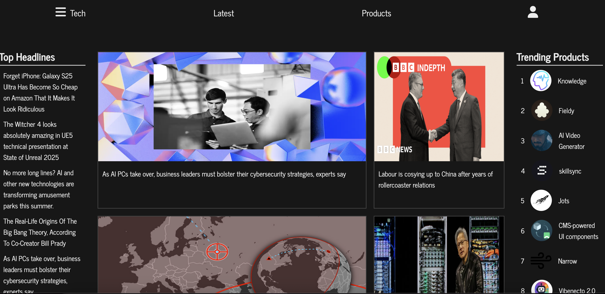

# TechHub

Live: https://techhubnews.centralindia.cloudapp.azure.com/

TechHub is a Django web application that aggregates tech news and trending startup products.  
Users can browse news, explore Product Hunt launches, like content, and leave comments.

[](https://www.youtube.com/watch?v=KjS6QxQ3Rfo)

---

## Features

- Latest tech news feed from different sources
- Trending products from Product Hunt
- User signup and login
- Like and bookmark functionality
- Comment system for articles and products
- Category based product browsing
- Search products
- Pagination for news and products

---


###  Setup Instructions

```bash
git clone https://github.com/ZLaTaN003/TechHub.git
cd your-repo-name
python -m venv venv
source venv/bin/activate
pip install -r requirements.txt
redis-server
celery -A news worker -l info
celery -A news beat -l info
python manage.py migrate
python manage.py runserver

```
