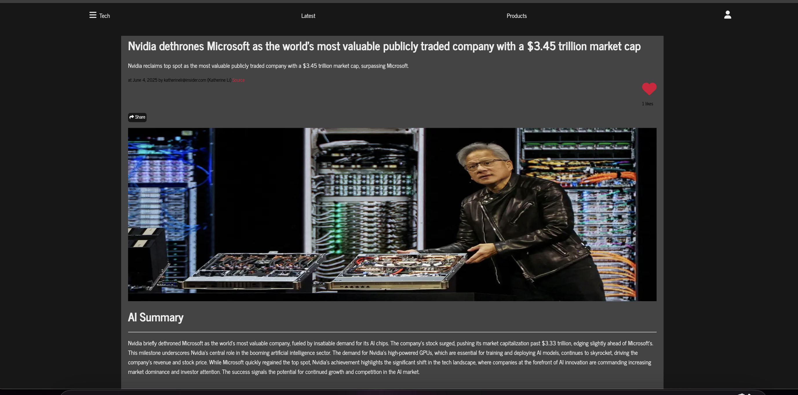

# Place to Get Tech News and Startup Ideas

## Get the latest tech news and inspiration for your next app!





###  Setup Instructions

```bash
git clone https://github.com/your-username/your-repo-name.git
cd your-repo-name
python -m venv venv
source venv/bin/activate
pip install -r requirements.txt
python manage.py migrate
python manage.py runserver

```